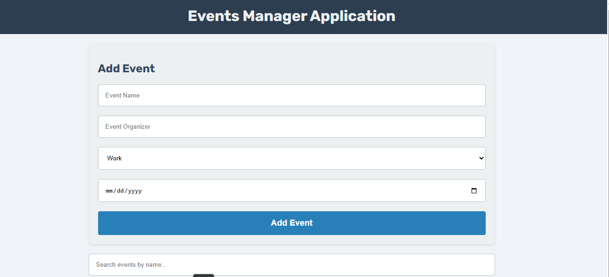

# 📅 Events Manager Application  

🌐 **Live Demo:** [View Project](https://amelchenni.github.io/Events-Manager-Application/)  

---

## 📖 Description  
The **Events Manager Application** is a dynamic web app that allows users to manage and keep track of their events easily.  
Whether it’s a personal reminder, a community gathering, or an organizational event, this app helps users organize their schedules effectively.  

---

## 🚀 Features  
- ➕ Add new events with title and details.  
- 📝 View a list of all scheduled events.  
- ❌ Delete events once they are completed or no longer needed.  
- 💾 Persistent storage using **Local Storage** (data remains saved even after refresh).  
- Responsive design for both desktop and mobile devices.  

---

## 🛠️ Technologies Used  
- **HTML5** – Structure  
- **CSS3** – Styling & Layout  
- **JavaScript (Vanilla)** – Logic & Event Handling  
- **Local Storage** – Persistent data storage  

---

## 📷 Preview  
  

---

## 📌 Future Improvements  
- Add **event categories** (e.g., work, personal, study).  
- Implement **edit functionality** for existing events.  
- Add **search and filter** options.  
- Enable **calendar integration** for a better user experience.  

---

## ▶️ Usage  
1. Clone this repository:  
   ```bash
   git clone https://github.com/AmelChenni/Events-Manager-Application.git
